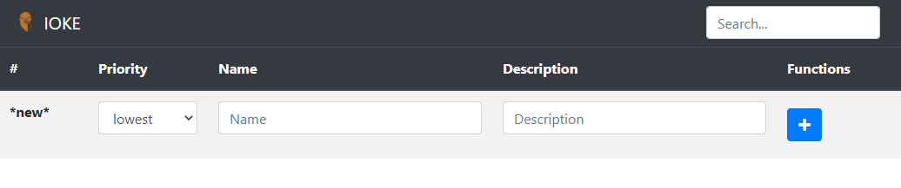
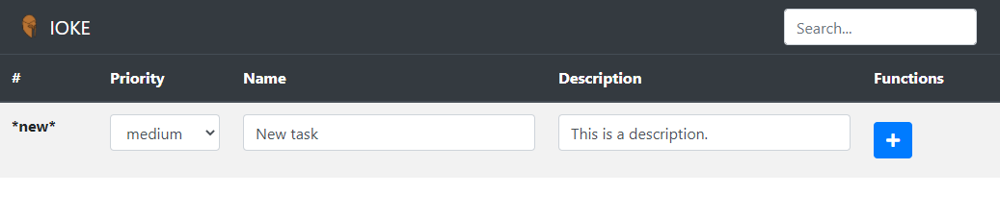
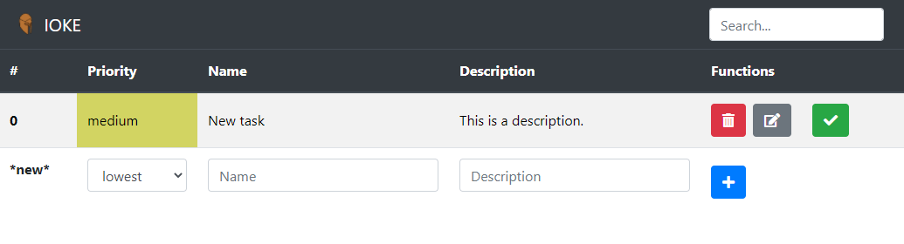
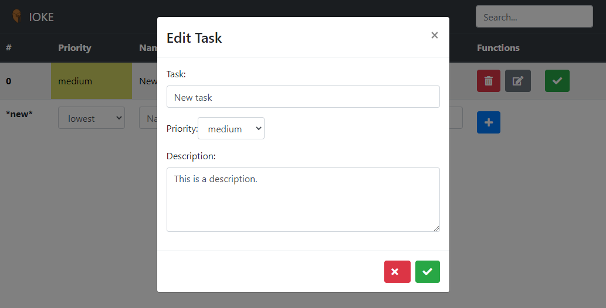
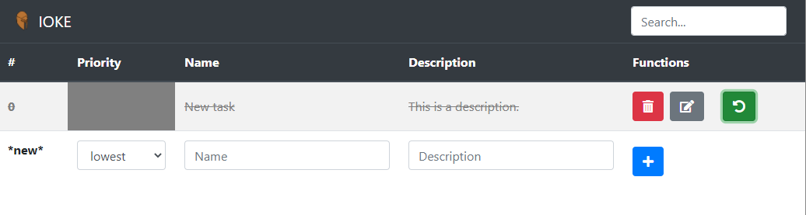
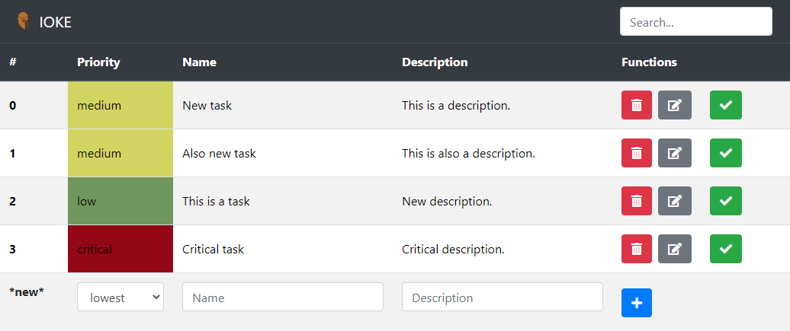
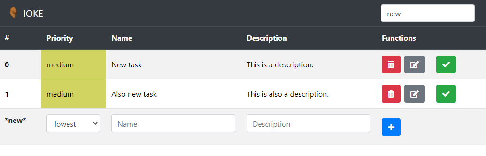

# IOKE 

IOKE is a simple html & javascript based note and planning app. It allows the user to create tasks, sort them by priority and delete them. IOKE **does not** have any persistency; close the site or refresh it and your data will be gone.  
The current master-branch has been deployed via [Github-pages](https://lucasf-42.github.io/kms-team6-v2/).  
More information on IOKE can be found in the projects wiki.

## Why Ioke?

Ioke is the greek godess of onslaught, battle-tumult, pursuit and rout. This app is supposed to drive you towards your set goals and have you take note of whatever you deem fit.

IOKE was created for the THM computer science course KMS as a simple application to try out several development theories.

## Prerequisites

IOKE requires [browserify 17.0.0 or newer](http://browserify.org/) as well as a modern web browser to be run manually. However, `npm` can also be used to build/run IOKE.

## Installation

After meeting the prerequisites IOKE can be built via the command `browserify scripts/script.js -o ./scripts/bundle.js`. It can be opened with the `index.html` 
file.  
Alernatively, using `npm`, it can be assembled and run via calling `npm run` from the projects root directory.

## How to use IOKE

IOKE allows you to organise tasks in a simple and straightforward manner.

### Create
You can create a new task by adding your data to the bottommost task, marked with number as `*new*`. Add the task
priority via a dropdown menu, set a name and give your task a description.

When all is set, add the task by clicking the `+` button. Violà, you have created your very first task.

### Edit
You can edit a created task by pressing the `edit` button, represented by the pen and notepad. This will open an edit
screen where you can edit the task.

You can change the values there and apply them by pressing the `apply` button, represented by the green check-mark, or 
dismiss any changes by pressing the `dismiss` button, represented by the red X.

### Delete
You can delete a created task by pressing the `delete` button, represented by the red trash bin.

This will permanently remove the task from the list; it cannot be recovered by any means, so be careful.

### Done
You can check a task as done by pressing the `done` button, represented by the green check-mark.

This will grey-out the task and mark it as done.

You can restore the task to an active state by pressing the `restore` button, represented by the green circling arrow.
This will return the task to it's normal state.

### Search
If you have alot of tasks at hand, you can use the search function to quickly find any task that has not been deleted. 
For this you can use the `Search` field in the top-right of the IOKE website.

Type in any word contained within the task's name or description; IOKE will only display tasks with a match.

## Contributing
This is a finished student project but pull requests are welcome. Please make sure to update tests as appropriate.
## License
[MIT](https://choosealicense.com/licenses/mit/)
